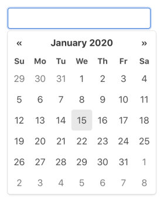
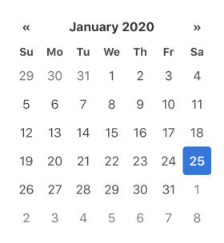
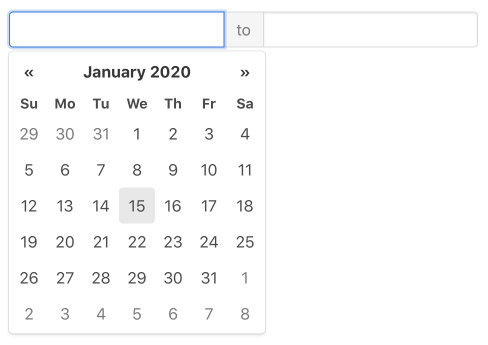

# Vanilla JS Datepicker

A vanilla JavaScript remake of [bootstrap-datepicker](https://github.com/uxsolutions/bootstrap-datepicker) for [Bulma](https://bulma.io) and other CSS frameworks  

This package is written from scratch as ECMAScript modules/[Sass](https://sass-lang.com) stylesheets to reproduce similar usability to bootstrap-datepicker.  
It can work either standalone or with CSS framework (e.g. [Bootstrap](https://getbootstrap.com), [Foundation](https://get.foundation)), but works best with [Bulma](https://bulma.io) as it's developed primarily for Bulma. 

The package also includes pre-built js/css files for those who like to use it directly on browser.

##### Features

- Date picker (input-dropdown, inline), date range picker
- Keyboard operation support (navigation by arrow keys, editing on input field)
- i18n support (locales, CSS-based text direction detection)
- Easily customizable to adapt stylesheet for various CSS frameworks
- Dependency free
- Made for modern browsers — no IE support
- Lightweight (well, relatively…) — 31kB (minified, uncompressed)

##### Demo

[Live Online Demo](https://raw.githack.com/mymth/vanillajs-datepicker/v1.0.3/demo/)

## Quick Start

Install the package using npm.

```bash
npm install --save-dev vanillajs-datepicker 
```

##### Date picker

– **Input picker**

1. create a text input element.

```html
<input type="text" name="foo">
```

2. import the `Datepicker` module.

```javascript
import Datepicker from 'path/to/node_modules/vanillajs-datepicker/js/Datepicker.js';
```

_Or if you use a baundler that supprots [pkg.module](https://github.com/rollup/rollup/wiki/pkg.module) (e.g. [Rollup](https://rollupjs.org/) with [node-resolve](https://github.com/rollup/plugins/tree/master/packages/node-resolve) plugin, [webpack](https://webpack.js.org/))_

```javascript
import { Datepicker } from 'vanillajs-datepicker';
```

3. call `Datepicker` constructor with the input element and, optionally, [config options](options).

```javascript
const elem = document.querySelector('input[name="foo"]');
const datepicker = new Datepicker(elem, {
  // ...options
}); 
```




– **Inline picker**

1. create a block element.

```html
<div id="foo" data-date="01/25/2020"></div>
```

2. import the `Datepicker` module in the same way as Input picker.


3. call `Datepicker` constructor with the block element and, optionally, [config options](options).

```javascript
const elem = document.getElementById('foo');
const datepicker = new Datepicker(elem, {
  // ...options
}); 
```




##### Date range picker

1. create a block element that contains 2 text input elements.

```html
<div id="foo">
  <input type="text" name="start">
  <span>to</span>
  <input type="text" name="end">  
</div>
```

2. import the `DateRangePicker` module.

```javascript
import DateRangePicker from 'path/to/node_modules/vanillajs-datepicker/js/DateRangePicker.js';
```

_Or if you use a baundler that supprots [pkg.module](https://github.com/rollup/rollup/wiki/pkg.module) (e.g. [Rollup](https://rollupjs.org/) with [node-resolve](https://github.com/rollup/plugins/tree/master/packages/node-resolve) plugin, [webpack](https://webpack.js.org/))_

```javascript
import { DateRangePicker } from 'vanillajs-datepicker';
```

3. call `DateRangePicker` constructor with the block element and, optionally, [config options](options).

```javascript
const elem = document.getElementById('foo');
const rangepicker = new DateRangePicker(elem, {
  // ...options
}); 
```



##### Stylesheet

1. import scss file.

```scss
@import 'path/to/node_modules/vanillajs-datepicker/sass/datepicker';
```

### Using with CSS framework

#### Bulma

1. import scss file for Bulma instead.

```scss
@import 'path/to/node_modules/vanillajs-datepicker/sass/datepicker-bulma';
```

#### Bootstrap

1. use `buttonClass: 'btn'` option to call `Datepicker`/`DateRangePicker` constructor.

```javascript
const datepicker = new Datepicker(elem, {
  buttonClass: 'btn',
}); 
```

2. import scss file for Bootstrap instead.

```scss
@import 'path/to/node_modules/vanillajs-datepicker/sass/datepicker-bs4';
```

#### Foundation

1. import scss file for Foundation instead.

```scss
@import 'path/to/node_modules/vanillajs-datepicker/sass/datepicker-foundation';
```

#### Other frameworks

 1. If the framework uses a specific class for button elements, set it to the `buttonClass` option to call `Datepicker`/`DateRangePicker` constructor.

```javascript
const datepicker = new Datepicker(elem, {
  buttonClass: 'uk-button',
}); 
```

2. Copy the following template into your sass stylesheet, and edit the node_module path, the variables, button class and button style adjustments to match your environment.

```scss
/***
 Copy the datepicer variables (the ones with `dp-` prefix and `!default` flag)
 from `sass/Datepicker.scss` to here
 Then, edit them using your framework's variables/values
 e.g.:
 $dp-background-color: $background !default;
 $dp-border-color: $border !default;
 ...
 ***/

@import '../node_modules/vanillajs-datepicker/sass/mixins';

@mixin dp-button {
  .button {
    /***
     Place style adjustment for date picker's buttons here, if needed
     ***/

    .datepicker-header & {
      @include dp-header-button-common;

      /***
       Place style adjustment specific to the header buttons here, if needed
       ***/
    }

    .datepicker-footer & {
      @include dp-footer-button-common;

      /***
       Place style adjustment specific to the footer buttons here, if needed
       ***/
    }
  }
}

@import '../node_modules/vanillajs-datepicker/sass/datepicker';
```

### Using from Browser

1. From CDN, load css and js files.

```html
<link rel="stylesheet" href="https://cdn.jsdelivr.net/npm/vanillajs-datepicker@1.0/dist/css/datepicker.min.css">

...

<script src="https://cdn.jsdelivr.net/npm/vanillajs-datepicker@1.0/dist/js/datepicker-full.min.js"></script>
```

_If you use Bulma, Bootstrap or Foundation, you can use the css for your framework instead._

```html
<link rel="stylesheet" href="https://cdn.jsdelivr.net/npm/vanillajs-datepicker@1.0/dist/css/datepicker-bulma.min.css">
<!-- or -->
<link rel="stylesheet" href="https://cdn.jsdelivr.net/npm/vanillajs-datepicker@1.0/dist/css/datepicker-bs4.min.css">
<!-- or -->
<link rel="stylesheet" href="https://cdn.jsdelivr.net/npm/vanillajs-datepicker@1.0/dist/css/datepicker-foundation.min.css">
```

_And if don't need date range, you can use the datepicker-only version of js file._

```html
<script src="https://cdn.jsdelivr.net/npm/vanillajs-datepicker@1.0/dist/js/datepicker.min.js"></script>
```

2. Call `Datepicker`/`DateRangePicker` constructor in the same way as explained [above](?id=quick-start). (The classes are exposed to global scope.)

```javascript
const elem = document.querySelector('input[name="foo"]');
const datepicker = new Datepicker(elem, {
  // ...options
}); 
```

