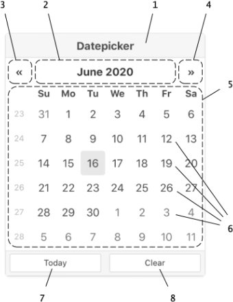
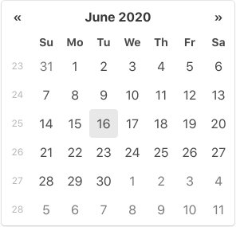
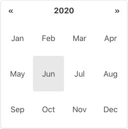
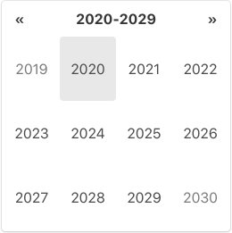
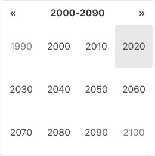
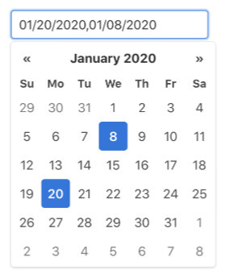

# Overview

## Types

##### Date picker (regular/text-input picker)

When Datepicker object is attached to an `<input>` element, it's configured as a regular date picker.

##### Inline picker

When Datepicker object is attached to a block element, it's configured as an inline picker.

- The picker element is embedded to the block element. (always shown)
- Initial selection can be set in the `data-date` attribute
- Inline picker does not support operation by keyboard.

##### Date range picker

Date range picker is essentially a wrapper/controller of 2 date pickers. It's the only type of DateRangePicker object.

- Date range picker cannot be attached to elements that contain less than 2 `<input>` elements
- Regular date picker is attached to each of `<input>` elements

## Picker Element

1. **Title bar**
2. **View switch**:  
   Button to change the view from days to months, months to years and years to decades  
   The button label is used for the title of view contents.
3. **Prev button**:  
   Button to change the contents of the current view to the previous month/year/decade/century
4. **Next button**:  
   Button to change the contents of the current view to the next month/year/decade/century
5. **View**:  
   Area to display a calendar (for days) or a grid of months, years, or decades
6. **Cell**:  
   Block for each day, month, year or decade  
   It works as a select button in days view. In the other views, it works as a button to change the view to the period of time it represents. (months view → days view of the month, years → months of the year, decades → years of the decade) 
7. **Today button**:  
   Button to jump to the current date  
   It can be customized to select the current date.
8. **Clear button**:  
   Button to clear the selection

##### Days view

The view to select a date. The days are displayed in monthly calendar layout. Optionally, ISO week numbers can be shown in the view.

##### Months view

The view to select a month. The months are shown in short name.

##### Years view

The view to select a year.

##### Decades view

The view to select a decade.

## Multidate Mode

When [`maxNumberOfDates`](options?id=maxnumberofdates) config option is set to other than `1`, date picker turns to the multdate mode.

In this mode, the day cells in the days view act as toggle switch of the date's select status. The order of selection is kept; newly selected date is appended to the existing selection and the oldest item in the selection drops if the number of selected dates exceeds the option's value.  
In the input field, selected dates are joined with the delimiter string set in the [`dateDelimiter`](options?id=dateDelimiter) config option.

Multidate mode is not applied to the pickers of date range picker.

## Providing date

Datepicker accepts [date string](date-string+format), Date object or [time value](https://developer.mozilla.org/en-US/docs/Web/JavaScript/Reference/Global_Objects/Date#Time_value_or_timestamp_number) for the source of a date. All given dates are parsed/converted into the internal date value individually.

> The time value of local time `00:00:00.000` of the date is used for the internal date value.

The dates before _January 1st, 0000_ are not supported because the built-in parser cannot handle negative numbers. (`-` sign is one of the predefined separator characters)

To provide dates for config options or API method arguments, you can just follow the above general rules.

##### Initial selection

To provide initial date selection to a date picker, you can set a date string to the `<input>` element's `value` attribute. This also works for date range picker's `<input>` elements.

For inline picker, you can set a date string to the `data-date` attribute of the element to attach the picker.

##### Input field

You can update the selected date by editing the date string in the input field.

> Since the built-in parser is very tolerant of format errors, a small typing error can cause an unexpected (and sometimes unimaginable) date in the input field. _(See [How Built-in Parser parses](./date-string+format?id=how-built-in-parser-parses))_  
> If you think this is not good, you might want to consider using the [`updateOnBlur`](./options?id=updateonblur):`false` config option in order to implicitly nudge users to look at their input.

## Keyboard Operation

You can operate date picker using keyboard. Here are the available keyboard operations.

**When picker is hidden**

- <KBD>**↓**</KBD> (arrowDown)**,** <kbd>**Esc**</kbd> **:**  
  Show the picker
- <kbd>**Enter**</kbd> **:**  
  Update the picker with the input field's value

**When picker is shown**

- <kbd>**Esc**</kbd> **:**  
  Hide the picker
- <kbd>**←**</kbd> (arrowLeft)**,** <kbd>**→**</kbd> (arrowRight) **:**  
  Move focused date/month/year/decade 1 step horizontally
- <kbd>**↑**</kbd> (arrowUp)**,** <kbd>**↓**</kbd> (arrowDown) **:**  
  Move focused date/month/year/decade 1 step vertically
- <kbd>**Ctrl**</kbd> (or <kbd>Meta</kbd>) **+** <kbd>**←**</kbd> (arrowLeft) **:**  
  Move to previous month/year/decade/century _(Shortcut of the "Prev" button)_
- <kbd>**Ctrl**</kbd> (or <kbd>Meta</kbd>) **+** <kbd>**→**</kbd> (arrowRight) **:**  
  Move to next month/year/decade/century _(Shortcut of the "Next" button)_
- <kbd>**Ctrl**</kbd> (or <kbd>Meta</kbd>) **+** <kbd>**↑**</kbd> (arrowUp) **:**    
  Change the view upward _(Shortcut of the view switch)_
- <kbd>**Enter**</kbd> **:**
  - *when days view is shown:*  
    Select the focused date 
  - *otherwise:*  
    Change the view downward for the focused decade/year/month 
- <kbd>**Backspace**</kbd>**,** <kbd>**Delete**</kbd>**, any printable character,** <kbd>**Shift**</kbd> **+ either of arrow keys** ( <kbd>←</kbd>/<kbd>→</kbd>/<kbd>↑</kbd>/<kbd>↓</kbd> ) **:**  
  Enter [edit mode](overview?id=edit-mode)

**When in [edit mode](overview?id=edit-mode)**

- <kbd>**Esc**</kbd> **:**  
  Hide the picker exiting edit mode
- <kbd>**Enter**</kbd> **:**   
  Exit edit mode updating the picker with the change on the input field

> Note: Keyboard operation is not supported by inline picker.

## Edit Mode 

When the picker element is shown, date picker (in the primary state) captures key-press events and uses them to control the picker element. Therefore, users cannot edit the `<input>` element in this state.  
To solve this, Datepicker has the edit mode.

Date picker automatically enters edit mode when:

- the `<input>` element is clicked
- <kbd>Backspace</kbd>, <kbd>Delete</kbd> or any of printable character key is pressed (without control/meta key).
- <kbd>Shift</kbd> + either of arrow keys ( <kbd>←</kbd>/<kbd>→</kbd>/<kbd>↑</kbd>/<kbd>↓</kbd> ) is pressed (without control/meta key).

and exits edit mode when:

- <kbd>Enter</kbd> key or <kbd>Esc</kbd> key is pressed
- the picker element becomes hidden

While date picker is in edit mode,

- highlight of the `<input>` element becomes more prominent
- keyboard operation of the picker element is temporarily disabled
